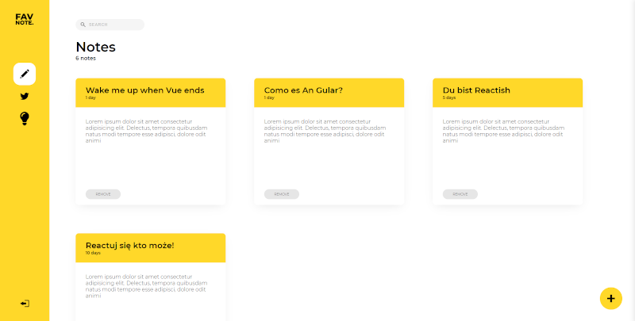
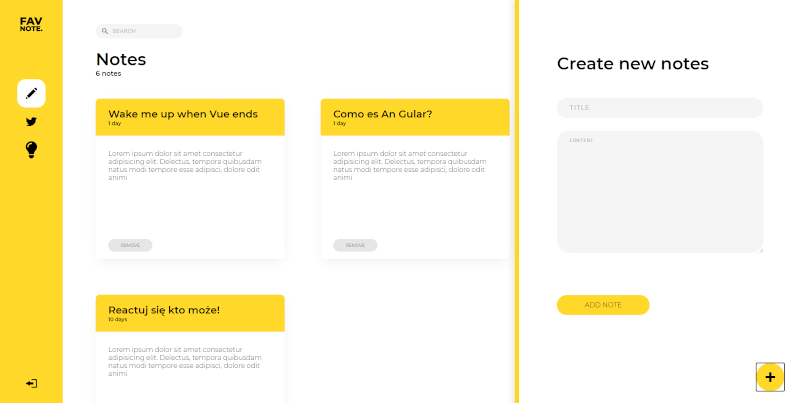
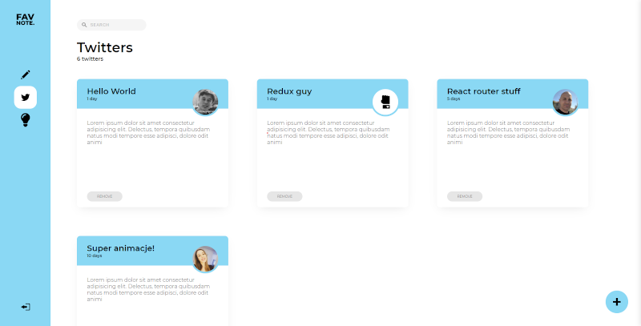
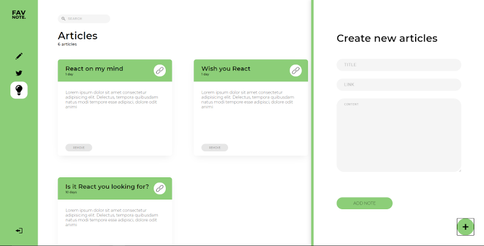
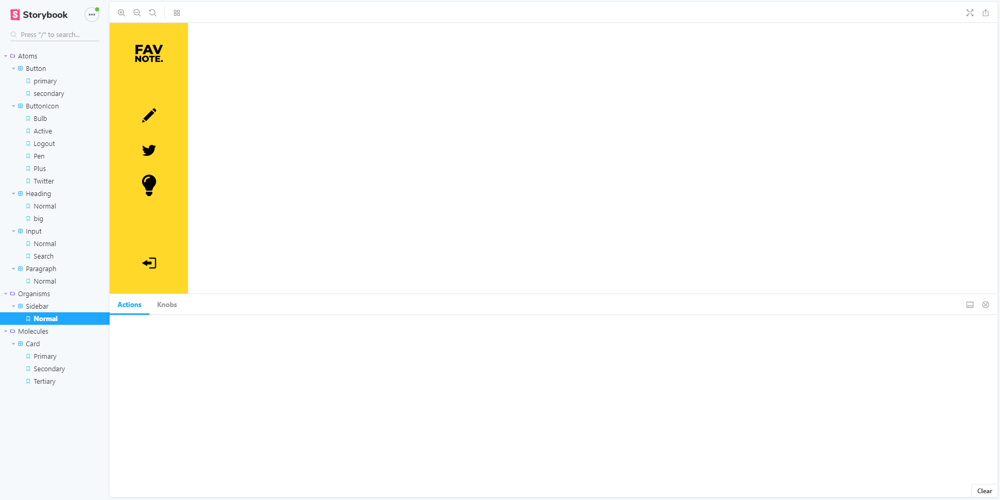

# Favnotes

App for taking notes, saving tweets and articles. Bulit with React, React Router, styled components and storybook for documenting components.

## Preview
### Notes

### Adding a note

### Tweets

### Saving a tweet

### Saving an article

## Available Scripts

In the project directory, you can run:

### `npm start`

Runs the app in the development mode. 
Open [http://localhost:3000](http://localhost:3000) to view it in the browser.

### `npm run storybook`

Runs storybook on [http://localhost:9009](http://localhost:9009)

### Storybook preview

